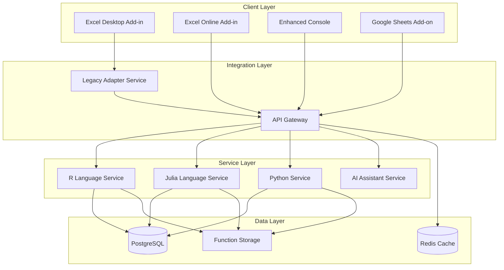

# BERT v3.0 Brownfield Enhancement Architecture

## Introduction

This document outlines the architectural approach for enhancing BERT (Basic Excel R Toolkit) v2.4.3 with comprehensive modernization including cloud-native architecture, updated dependencies, multi-platform support, and enterprise features. Its primary goal is to serve as the guiding architectural blueprint for AI-driven development of new features while ensuring seamless integration with the existing system.

**Relationship to Existing Architecture:**
This document supplements existing BERT v2.4.3 monorepo architecture by defining how new microservices components will integrate with current C++/COM Excel Add-in, TypeScript Console, and language controllers. Where conflicts arise between new cloud-native patterns and existing desktop patterns, this document provides guidance on maintaining backward compatibility while implementing modern enhancements.

### Existing Project Analysis

**Current Project State:**
- **Primary Purpose:** Excel integration connector for R and Julia programming languages with interactive console
- **Current Tech Stack:** C++ (BERT Core/COM), TypeScript (Electron Console), R 3.4.x, Julia 0.6.2, Protocol Buffers 3.5.0, Visual Studio 2017
- **Architecture Style:** Monolithic desktop application with process separation between Excel Add-in and language services
- **Deployment Method:** Windows installer with local process management and file-based configuration

**Available Documentation:**
- README.md with installation and overview information
- package.json defining Console dependencies and build scripts
- Visual Studio solution files (.sln, .vcxproj) for C++ components
- Protocol Buffers schema definitions for IPC communication
- Example R and Julia function files demonstrating usage patterns

**Identified Constraints:**
- Windows-only deployment with Excel COM interface dependencies
- Legacy language versions (R 3.4.x, Julia 0.6.2) with potential breaking changes in modern versions
- File-based configuration storage limiting scalability and collaboration
- Electron 1.8.2 with security vulnerabilities and limited modern features
- No automated testing or CI/CD infrastructure
- Monolithic architecture limiting independent scaling and platform expansion

### Change Log
| Change | Date | Version | Description | Author |
|--------|------|---------|-------------|---------|
| Initial Architecture | 2024-01-15 | 3.0.0 | Brownfield enhancement architecture creation | BMad Master |

## Enhancement Scope and Integration Strategy

### Enhancement Overview
**Enhancement Type:** Technology Stack Upgrade + Performance/Scalability Improvements + Integration with New Systems + Major Feature Modification
**Scope:** Complete modernization to cloud-native microservices while maintaining 100% backward compatibility
**Integration Impact:** Major Impact - architectural changes required with careful preservation of existing functionality

### Integration Approach
**Code Integration Strategy:** Gradual migration using adapter pattern - new microservices communicate through API Gateway while existing COM interface preserved through legacy adapter layer

**Database Integration:** Migration from file-based configuration to PostgreSQL with automated migration scripts preserving existing user configurations and function definitions

**API Integration:** Hybrid approach - new REST/gRPC APIs for modern clients while maintaining existing COM interfaces for Excel Add-in backward compatibility

**UI Integration:** Micro-frontend architecture allowing existing Electron Console to coexist with new React-based components, gradual feature migration with consistent user experience

### Compatibility Requirements
- **Existing API Compatibility:** COM interface methods preserved through adapter layer, existing VBA integration maintained
- **Database Schema Compatibility:** Automated migration preserves all user functions, configurations, and workspace settings
- **UI/UX Consistency:** Existing keyboard shortcuts, menu structures, and workflows preserved in enhanced Console
- **Performance Impact:** <20% memory increase, <100ms response time for equivalent functionality

## Tech Stack Alignment

### Existing Technology Stack
| Category | Current Technology | Version | Usage in Enhancement | Notes |
|----------|-------------------|---------|---------------------|-------|
| Core Language | C++ | Visual Studio 2017 | Maintained for Excel Add-in | COM interface requires C++ |
| Frontend | TypeScript/Electron | 1.8.2 | Upgraded to 28+ | Security and feature requirements |
| R Integration | R | 3.4.x | Upgraded to 4.3+ | Backward compatibility layer |
| Julia Integration | Julia | 0.6.2 | Upgraded to 1.9+ | Version management system |
| IPC | Protocol Buffers | 3.5.0 | Upgraded to v4 | Message compatibility preserved |
| Build System | Visual Studio | 2017 | Migrated to GitHub Actions | Modern CI/CD requirements |

### New Technology Additions
| Technology | Version | Purpose | Rationale | Integration Method |
|------------|---------|---------|-----------|-------------------|
| Docker | 24+ | Service containerization | Scalability and deployment | Microservices packaging |
| Node.js/Express | 18+ | API Gateway | Service orchestration | REST API layer |
| PostgreSQL | 15+ | Configuration storage | Scalability and collaboration | Migration from file-based |
| React | 18+ | Modern UI components | Enhanced user experience | Micro-frontend integration |
| gRPC | Latest | Service communication | Performance and type safety | Inter-service communication |

## Data Models and Schema Changes

### New Data Models

#### User Management Model
**Purpose:** Enterprise user authentication and authorization
**Integration:** Extends existing single-user configuration with multi-user support

**Key Attributes:**
- user_id: UUID - Unique user identifier
- email: String - User email for SSO integration
- role: Enum - User role (admin, developer, analyst)
- workspace_access: Array - Accessible workspace IDs
- created_at: Timestamp - Account creation time

**Relationships:**
- **With Existing:** Links to existing user functions and configurations
- **With New:** Related to Workspace and Function models

#### Workspace Model
**Purpose:** Collaborative workspace management for function sharing
**Integration:** Groups existing user functions into shareable workspaces

**Key Attributes:**
- workspace_id: UUID - Unique workspace identifier
- name: String - Workspace display name
- owner_id: UUID - Workspace owner reference
- members: Array - Workspace member user IDs
- functions: Array - Associated function IDs

**Relationships:**
- **With Existing:** Contains existing user-defined functions
- **With New:** Related to User and Function models

#### Function Registry Model
**Purpose:** Centralized function management with versioning
**Integration:** Enhances existing function storage with metadata and versioning

**Key Attributes:**
- function_id: UUID - Unique function identifier
- name: String - Function name
- language: Enum - R, Julia, Python
- version: String - Semantic version
- source_code: Text - Function implementation
- metadata: JSON - Function documentation and parameters

**Relationships:**
- **With Existing:** Migrates existing function definitions
- **With New:** Related to Workspace and User models

### Schema Integration Strategy
**Database Changes Required:**
- **New Tables:** users, workspaces, function_registry, audit_logs, plugin_registry
- **Modified Tables:** Existing configuration files migrated to structured tables
- **New Indexes:** user_id, workspace_id, function_name for performance
- **Migration Strategy:** Automated migration scripts with rollback capability, zero-downtime deployment

**Backward Compatibility:**
- Existing file-based configurations automatically migrated during first startup
- Legacy function definitions preserved with identical execution behavior
- Configuration file format maintained for non-enterprise deployments

## Component Architecture

### New Components

#### API Gateway Service
**Responsibility:** Central request routing, authentication, and load balancing for all client requests
**Integration Points:** Routes requests to appropriate language services, handles authentication with existing and new clients

**Key Interfaces:**
- REST API endpoints for web clients (Excel Online, Google Sheets)
- gRPC interfaces for high-performance desktop communication
- WebSocket connections for real-time collaboration features

**Dependencies:**
- **Existing Components:** Communicates with existing COM interface through adapter
- **New Components:** Routes to R Service, Julia Service, Python Service
- **Technology Stack:** Node.js/Express, Redis for caching, JWT for authentication

#### R Language Service
**Responsibility:** Containerized R execution environment with modern R 4.3+ support and legacy compatibility
**Integration Points:** Replaces existing ControlR component with backward-compatible API

**Key Interfaces:**
- gRPC service interface for function execution
- REST endpoints for web client integration
- Legacy adapter interface for existing COM communication

**Dependencies:**
- **Existing Components:** Maintains compatibility with existing R function definitions
- **New Components:** Communicates through API Gateway, uses shared Function Registry
- **Technology Stack:** Docker container, R 4.3+, gRPC server, legacy R 3.4.x compatibility layer

#### Julia Language Service
**Responsibility:** Containerized Julia execution environment with modern Julia 1.9+ support and legacy compatibility
**Integration Points:** Replaces existing ControlJulia component with enhanced capabilities

**Key Interfaces:**
- gRPC service interface for function execution
- REST endpoints for web client integration
- Version management for Julia 0.6.2 compatibility

**Dependencies:**
- **Existing Components:** Maintains compatibility with existing Julia function definitions
- **New Components:** Communicates through API Gateway, uses shared Function Registry
- **Technology Stack:** Docker container, Julia 1.9+, gRPC server, version management system

#### Legacy Adapter Service
**Responsibility:** Maintains COM interface compatibility for existing Excel Add-in integration
**Integration Points:** Bridges existing BERT Core C++ component with new microservices architecture

**Key Interfaces:**
- COM interface methods identical to existing BERT v2.4.3
- Internal gRPC client for communication with new services
- Protocol Buffers v3 compatibility layer

**Dependencies:**
- **Existing Components:** Direct integration with existing BERT Core C++ component
- **New Components:** Client of API Gateway and language services
- **Technology Stack:** C++, COM, gRPC client, Protocol Buffers compatibility

#### Enhanced Console Application
**Responsibility:** Modern Electron-based console with React components and AI assistance
**Integration Points:** Gradual migration from existing TypeScript Console with feature parity

**Key Interfaces:**
- Electron main process with enhanced security
- React-based UI components with micro-frontend architecture
- WebSocket connections for real-time features

**Dependencies:**
- **Existing Components:** Maintains existing keyboard shortcuts and workflows
- **New Components:** Client of API Gateway, integrates with AI services
- **Technology Stack:** Electron 28+, React 18+, TypeScript, Monaco Editor

### Component Interaction Diagram



## API Design and Integration

### API Integration Strategy
**API Integration Strategy:** Hybrid REST/gRPC approach - REST for web clients and external integrations, gRPC for high-performance internal service communication
**Authentication:** JWT tokens with SSO integration (Azure AD, SAML), backward compatible with existing single-user mode
**Versioning:** Semantic versioning with v1 maintaining existing behavior, v2+ introducing new features

### New API Endpoints

#### Function Execution Endpoint
- **Method:** POST
- **Endpoint:** `/api/v1/functions/execute`
- **Purpose:** Execute user-defined functions in specified language environment
- **Integration:** Replaces existing COM-based function execution with REST interface

**Request:**
```json
{
  "function_name": "TestAdd",
  "language": "R",
  "parameters": [1, 2, 3, 4, 5],
  "workspace_id": "uuid",
  "execution_context": {
    "timeout": 30000,
    "memory_limit": "512MB"
  }
}
```

**Response:**
```json
{
  "result": 15,
  "execution_time": 45,
  "status": "success",
  "output_logs": ["Executing TestAdd function"],
  "warnings": [],
  "function_metadata": {
    "version": "1.0.0",
    "last_modified": "2024-01-15T10:30:00Z"
  }
}
```

#### Workspace Management Endpoint
- **Method:** GET/POST/PUT/DELETE
- **Endpoint:** `/api/v1/workspaces`
- **Purpose:** Manage collaborative workspaces for function sharing
- **Integration:** New functionality extending existing single-user model

**Request:**
```json
{
  "name": "Data Analysis Team",
  "description": "Shared workspace for data analysis functions",
  "members": ["user1@company.com", "user2@company.com"],
  "permissions": {
    "read": ["analyst"],
    "write": ["developer"],
    "admin": ["admin"]
  }
}
```

**Response:**
```json
{
  "workspace_id": "uuid",
  "name": "Data Analysis Team",
  "created_at": "2024-01-15T10:30:00Z",
  "member_count": 2,
  "function_count": 15,
  "owner": "admin@company.com"
}
```

## External API Integration

### OpenAI API
- **Purpose:** AI-assisted code generation and natural language query processing
- **Documentation:** https://platform.openai.com/docs
- **Base URL:** https://api.openai.com/v1
- **Authentication:** API Key with secure storage
- **Integration Method:** REST client with rate limiting and error handling

**Key Endpoints Used:**
- `POST /chat/completions` - Natural language to code generation
- `POST /embeddings` - Function similarity and search

**Error Handling:** Graceful degradation when AI services unavailable, local fallback for basic code completion

### Azure Active Directory API
- **Purpose:** Enterprise SSO authentication and user management
- **Documentation:** https://docs.microsoft.com/en-us/azure/active-directory/
- **Base URL:** https://login.microsoftonline.com
- **Authentication:** OAuth 2.0 with PKCE
- **Integration Method:** MSAL library integration with token caching

**Key Endpoints Used:**
- `POST /oauth2/v2.0/token` - Token acquisition and refresh
- `GET /v1.0/me` - User profile information

**Error Handling:** Fallback to local authentication when Azure AD unavailable

## Source Tree Integration

### Existing Project Structure
```
Basic-Excel-R-Toolkit/
├── BERT/                    # C++ Excel Add-in
├── Console/                 # TypeScript Electron Console
├── ControlR/               # R Language Controller
├── ControlJulia/           # Julia Language Controller
├── Ribbon/                 # Excel Ribbon Interface
├── Examples/               # Sample functions
├── Build/                  # Build output directory
└── README.md
```

### New File Organization
```
Basic-Excel-R-Toolkit/
├── BERT/                           # Existing C++ Excel Add-in (preserved)
├── Console/                        # Enhanced Electron Console
│   ├── src/
│   │   ├── components/            # New React components
│   │   ├── services/              # API client services
│   │   └── legacy/                # Existing TypeScript modules
├── services/                       # New microservices directory
│   ├── api-gateway/               # API Gateway service
│   │   ├── src/
│   │   ├── Dockerfile
│   │   └── package.json
│   ├── r-service/                 # R Language Service
│   │   ├── src/
│   │   ├── Dockerfile
│   │   └── requirements.txt
│   ├── julia-service/             # Julia Language Service
│   │   ├── src/
│   │   ├── Dockerfile
│   │   └── Project.toml
│   └── legacy-adapter/            # Legacy COM Adapter
│       ├── src/
│       └── CMakeLists.txt
├── web-clients/                    # New web-based clients
│   ├── excel-online/              # Excel Online Add-in
│   ├── google-sheets/             # Google Sheets Add-on
│   └── web-console/               # PWA Console
├── infrastructure/                 # New deployment infrastructure
│   ├── docker-compose.yml
│   ├── kubernetes/
│   └── terraform/
├── docs/                          # Enhanced documentation
│   ├── prd.md                     # Product Requirements
│   ├── architecture.md            # This document
│   └── api/                       # API documentation
├── .github/                       # New CI/CD workflows
│   └── workflows/
└── tests/                         # New comprehensive test suite
    ├── unit/
    ├── integration/
    └── e2e/
```

### Integration Guidelines
- **File Naming:** Maintain existing C++ conventions (PascalCase), use kebab-case for new services, camelCase for TypeScript
- **Folder Organization:** Preserve existing monorepo structure, add new service directories with clear separation
- **Import/Export Patterns:** Maintain existing module patterns, use ES6 imports for new TypeScript/JavaScript code

## Infrastructure and Deployment Integration

### Existing Infrastructure
**Current Deployment:** Windows installer (.msi) with local installation and manual updates
**Infrastructure Tools:** Visual Studio build system, manual release process
**Environments:** Single production environment with user-managed installations

### Enhancement Deployment Strategy
**Deployment Approach:** Hybrid deployment - containerized services with traditional desktop installer for Excel Add-in
**Infrastructure Changes:** Docker containers for services, Kubernetes for orchestration, GitHub Actions for CI/CD
**Pipeline Integration:** Automated builds, testing, and deployment with blue-green strategy for services

### Rollback Strategy
**Rollback Method:** Service-level rollback using Kubernetes deployments, desktop component rollback through installer versioning
**Risk Mitigation:** Feature flags for gradual rollout, comprehensive monitoring and alerting
**Monitoring:** Prometheus metrics, Grafana dashboards, ELK stack for logging

## Coding Standards and Conventions

### Existing Standards Compliance
**Code Style:** C++ follows Visual Studio defaults, TypeScript uses basic ESLint configuration
**Linting Rules:** Minimal linting currently in place, no automated enforcement
**Testing Patterns:** Limited unit testing, no integration or end-to-end testing
**Documentation Style:** Inline comments, README files, no API documentation

### Enhancement-Specific Standards
- **API Documentation:** OpenAPI 3.0 specifications for all REST endpoints
- **Container Standards:** Multi-stage Docker builds, security scanning, minimal base images
- **Microservice Patterns:** Health checks, graceful shutdown, circuit breakers
- **Security Standards:** Input validation, secure secret management, audit logging

### Critical Integration Rules
- **Existing API Compatibility:** All existing COM interface methods must remain functional with identical signatures
- **Database Integration:** All database operations must include rollback capability and transaction management
- **Error Handling:** Maintain existing error message formats for backward compatibility while enhancing error details
- **Logging Consistency:** Preserve existing log formats while adding structured logging for new components

## Testing Strategy

### Integration with Existing Tests
**Existing Test Framework:** Limited unit tests using basic C++ testing, no formal JavaScript testing framework
**Test Organization:** Tests scattered across component directories, no centralized test management
**Coverage Requirements:** No formal coverage requirements, minimal existing test coverage

### New Testing Requirements

#### Unit Tests for New Components
- **Framework:** Jest for JavaScript/TypeScript, Google Test for C++, pytest for Python components
- **Location:** `tests/unit/` directory with component-specific subdirectories
- **Coverage Target:** >90% code coverage for all new components
- **Integration with Existing:** Preserve existing test behavior while adding comprehensive coverage

#### Integration Tests
- **Scope:** Service-to-service communication, database integration, API endpoint validation
- **Existing System Verification:** All existing function execution paths validated through integration tests
- **New Feature Testing:** End-to-end testing of new collaborative features and multi-platform support

#### Regression Testing
- **Existing Feature Verification:** Automated test suite validating all BERT v2.4.3 functionality remains intact
- **Automated Regression Suite:** GitHub Actions workflow running full regression suite on every commit
- **Manual Testing Requirements:** User acceptance testing for UI changes and workflow modifications

## Security Integration

### Existing Security Measures
**Authentication:** Single-user local authentication, no centralized user management
**Authorization:** File system permissions for function access control
**Data Protection:** Local file encryption for sensitive configurations
**Security Tools:** Basic Windows security features, no automated security scanning

### Enhancement Security Requirements
**New Security Measures:** JWT-based authentication, role-based access control, encrypted data transmission
**Integration Points:** SSO integration with enterprise identity providers, API security with rate limiting
**Compliance Requirements:** SOX compliance for financial data, GDPR compliance for user data

### Security Testing
**Existing Security Tests:** No formal security testing currently implemented
**New Security Test Requirements:** Automated security scanning in CI/CD, penetration testing for API endpoints
**Penetration Testing:** Annual third-party security assessment, automated vulnerability scanning

## Next Steps

### Story Manager Handoff
The Story Manager should begin implementation with Story 1.1 (Infrastructure Foundation and CI/CD Pipeline) as it establishes the foundation for all subsequent development. Key integration requirements validated:
- Existing BERT v2.4.3 build process must remain functional during transition
- All current functionality must be preserved through comprehensive regression testing
- Performance benchmarks must meet or exceed current system capabilities

Critical constraints from actual project analysis:
- Windows COM interface dependencies require careful handling during modernization
- Legacy language versions (R 3.4.x, Julia 0.6.2) need compatibility layers
- File-based configuration migration must be seamless and reversible

First story implementation should focus on establishing CI/CD pipeline while maintaining existing Visual Studio build capability for smooth transition.

### Developer Handoff
Developers beginning implementation should reference this architecture document alongside existing coding patterns identified in the codebase analysis. Integration requirements validated with user include:
- Preservation of existing C++ COM interface patterns for Excel Add-in compatibility
- Maintenance of existing TypeScript Console workflows and keyboard shortcuts
- Backward compatibility for all existing user-defined R and Julia functions

Key technical decisions based on real project constraints:
- Microservices architecture chosen to address scalability limitations while preserving desktop functionality
- Hybrid deployment strategy accommodates existing Windows installer expectations
- Legacy adapter pattern ensures zero-disruption migration for existing users

Existing system compatibility requirements with specific verification steps:
- Every new component must include integration verification tests
- Performance impact must be measured against current BERT v2.4.3 benchmarks
- User function execution behavior must remain identical to preserve existing workflows

Clear sequencing of implementation to minimize risk to existing functionality:
1. Establish CI/CD foundation without disrupting current build process
2. Modernize dependencies with compatibility layers before removing legacy versions
3. Implement microservices architecture while maintaining existing interfaces
4. Gradually migrate UI components while preserving existing user workflows

---

## 🎯 **PRÓXIMA PROPUESTA BMad**

**Architecture Document completo creado exitosamente.** El documento define la arquitectura técnica completa para BERT v3.0 con integración detallada del sistema existente.

**¿Deseas que proceda con el siguiente paso del flujo BMad?**

**Opciones:**
1. **✅ RECOMENDADO: Ejecutar PO Master Checklist** - Validar que PRD + Architecture resuelven las 23 deficiencias críticas
2. **Proceder a Document Sharding** - Preparar documentos para desarrollo inmediato
3. **Revisar/ajustar Architecture** - Si necesitas modificaciones específicas

**Mi recomendación**: Ejecutar PO Master Checklist para validación final antes de proceder al desarrollo.