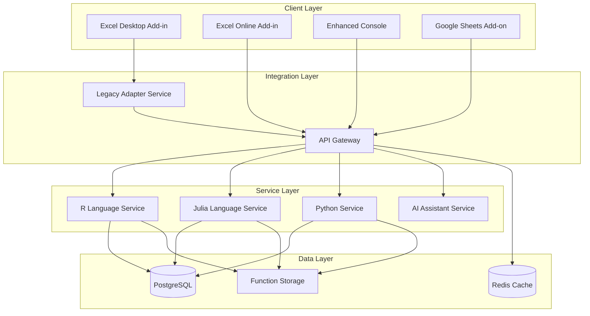

# Component Architecture

## New Components

### API Gateway Service
**Responsibility:** Central request routing, authentication, and load balancing for all client requests
**Integration Points:** Routes requests to appropriate language services, handles authentication with existing and new clients

**Key Interfaces:**
- REST API endpoints for web clients (Excel Online, Google Sheets)
- gRPC interfaces for high-performance desktop communication
- WebSocket connections for real-time collaboration features

**Dependencies:**
- **Existing Components:** Communicates with existing COM interface through adapter
- **New Components:** Routes to R Service, Julia Service, Python Service
- **Technology Stack:** Node.js/Express, Redis for caching, JWT for authentication

### R Language Service
**Responsibility:** Containerized R execution environment with modern R 4.3+ support and legacy compatibility
**Integration Points:** Replaces existing ControlR component with backward-compatible API

**Key Interfaces:**
- gRPC service interface for function execution
- REST endpoints for web client integration
- Legacy adapter interface for existing COM communication

**Dependencies:**
- **Existing Components:** Maintains compatibility with existing R function definitions
- **New Components:** Communicates through API Gateway, uses shared Function Registry
- **Technology Stack:** Docker container, R 4.3+, gRPC server, legacy R 3.4.x compatibility layer

### Julia Language Service
**Responsibility:** Containerized Julia execution environment with modern Julia 1.9+ support and legacy compatibility
**Integration Points:** Replaces existing ControlJulia component with enhanced capabilities

**Key Interfaces:**
- gRPC service interface for function execution
- REST endpoints for web client integration
- Version management for Julia 0.6.2 compatibility

**Dependencies:**
- **Existing Components:** Maintains compatibility with existing Julia function definitions
- **New Components:** Communicates through API Gateway, uses shared Function Registry
- **Technology Stack:** Docker container, Julia 1.9+, gRPC server, version management system

### Legacy Adapter Service
**Responsibility:** Maintains COM interface compatibility for existing Excel Add-in integration
**Integration Points:** Bridges existing BERT Core C++ component with new microservices architecture

**Key Interfaces:**
- COM interface methods identical to existing BERT v2.4.3
- Internal gRPC client for communication with new services
- Protocol Buffers v3 compatibility layer

**Dependencies:**
- **Existing Components:** Direct integration with existing BERT Core C++ component
- **New Components:** Client of API Gateway and language services
- **Technology Stack:** C++, COM, gRPC client, Protocol Buffers compatibility

### Enhanced Console Application
**Responsibility:** Modern Electron-based console with React components and AI assistance
**Integration Points:** Gradual migration from existing TypeScript Console with feature parity

**Key Interfaces:**
- Electron main process with enhanced security
- React-based UI components with micro-frontend architecture
- WebSocket connections for real-time features

**Dependencies:**
- **Existing Components:** Maintains existing keyboard shortcuts and workflows
- **New Components:** Client of API Gateway, integrates with AI services
- **Technology Stack:** Electron 28+, React 18+, TypeScript, Monaco Editor

## Component Interaction Diagram

